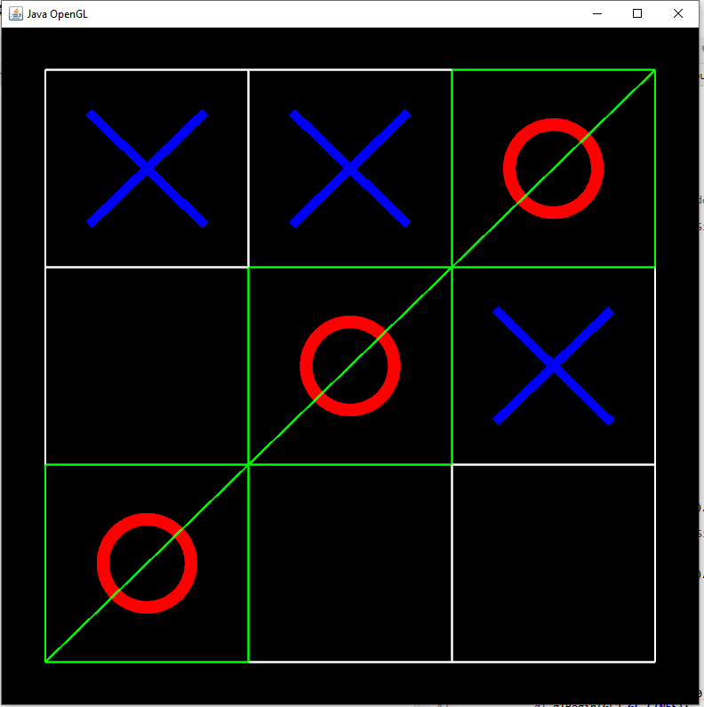

# Tic-Tac-Toe OpenGL
this was a project for my Graphcal user interface class\
I have developed a Tic-Tac-Toe game from scratch using JOGL (Java OpenGL)\
the game was made to be playable both in player vs player mode and player vs computer mode\
for the "AI" I have implemented an min-max algorithm

